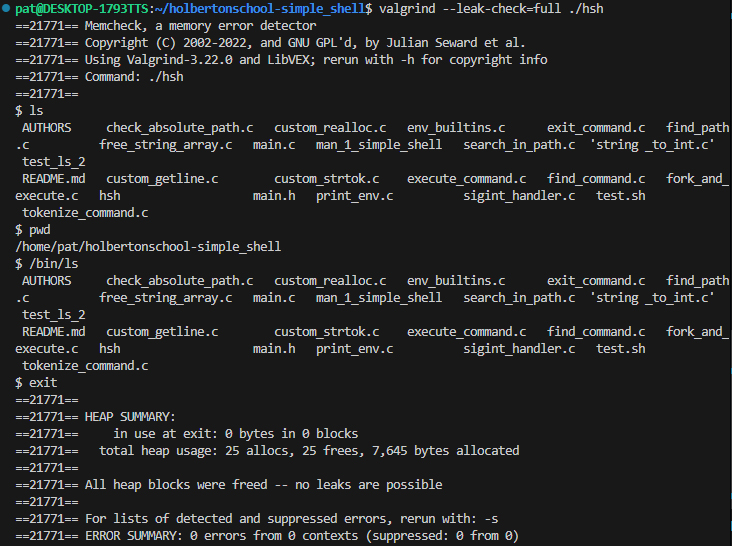
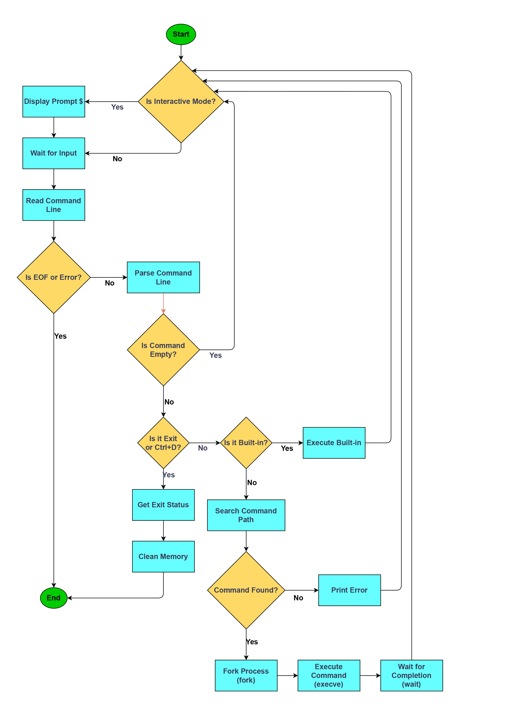

<p align="center">

<h1>Simple Shell</h1>
Release date January 10, 2025
</p>

- [What is Shell](#what-is-shell)
- [Holberton School project](#holberton-school-project)
- [Tasks](#tasks)
- [Files](#files)
- [General requirements](#general-requirements)
- [Allowed functions](#allowed-functions)
- [Installation](#installation)
- [Man page](#man-page)
- [Testing](#testing)
- [Flowchart](#flowchart)
- [Authors](#authors)

## What is Shell
A shell is a command-line interface that acts as an intermediary between the user and the operating system kernel. It interprets user commands, either interactively (typed directly into the terminal) or non-interactively (read from a script), and translates them into system calls that the operating system can understand and execute.

## Holberton School project
A lightweight UNIX command interpreter that executes commands from standard input. Built in C as part of the Holberton School curriculum, this shell implements core features like command execution with arguments, environment variable handling, and essential built-in commands.

## Tasks

*  README, man, AUTHORS.
*  Write a beautiful code that passes the Betty checks.
*  Write a UNIX command line interpreter.
*  Handle command lines with arguments.
*  Handle the PATH.
*  Implement the exit built-in, that exits the shell.
*  Implement the env built-in, that prints the current environment.

## Files

|File|Description|
|---|---|
|[AUTHORS](https://github.com/Pmichel74/holbertonschool-simple_shell/blob/main/AUTHORS)|Contributors in this repository|
|[README.md](https://github.com/Pmichel74holbertonschool-simple_shell/blob/main/README.md)|Information about our repository|
|[man_1_simple_shell](https://github.com/Pmichel74/holbertonschool-simple_shell/blob/main/man_1_simple_shell)|Shell man page|
|[check_absolute_path.c](https://github.com/Pmichel74/holbertonschool-simple_shell/blob/main/check_absolute_path.c )|Checks if a path is absolute|
|[custom_getline.c](https://github.com/Pmichel74//holbertonschool-simple_shell/blob/main/custom_getline.c)|Custom getline for input reading|
|[custom_realloc.c](https://github.com/Pmichel74//holbertonschool-simple_shell/blob/main/custom_realloc.c)|Custom implementation of realloc function for memory management|
|[custom_strtok.c](https://github.com/Pmichel74/holbertonschool-simple_shell/blob/main/custom_strtok.c)|Custom implementation of strtok function for string parsing|
|[env_builtins.c](https://github.com/Pmichel74/holbertonschool-simple_shell/blob/main/env_builtins.c)|Handles built-in environment commands (env, setenv, unsetenv)|
|[execute_command.c](https://github.com/Pmichel74/holbertonschool-simple_shell/blob/main/execute_command.c)|Handles shell command execution|
|[find_command.c](https://github.com/Pmichel74/holbertonschool-simple_shell/blob/main/find_command.c)|Searches for commands in PATH|
|[find_path.c](https://github.com/Pmichel74/holbertonschool-simple_shell/blob/main/find_path.c)|Handles PATH and executable search|
|[fork_and_execute.c](https://github.com/Pmichel74/holbertonschool-simple_shell/blob/main/fork_and_execute.c)|Manages process creation and execution|
|[free_args.c](https://github.com/Pmichel74/holbertonschool-simple_shell/blob/main/free_args.c)|Frees argument memory|
|[free_tokens.c](https://github.com/Pmichel74/holbertonschool-simple_shell/blob/main/free_tokens.c)|Frees token memory|
|[hsh](https://github.com/Pmichel74/holbertonschool-simple_shell/blob/main/hsh)|Shell executable|
|[free_string_array.c](https://github.com/Pmichel74/holbertonschool-simple_shell/blob/main/free_string_array.c)|Frees memory allocated for array of strings|
|[main.c](https://github.com/Pmichel74/holbertonschool-simple_shell/blob/main/main.c)|Program entry point|
|[main.h](https://github.com/Pmichel74/holbertonschool-simple_shell/blob/main/main.h)|Header file with prototypes and structures |
|[print_env.c](https://github.com/Pmichel74/holbertonschool-simple_shell/blob/main/print_env.c)|Displays environment variables|
|[search_in_path.c](https://github.com/Pmichel74/holbertonschool-simple_shell/blob/main/search_in_path.c)|Searches commands in PATH directories|
|[sigint_handler.c](https://github.com/Pmichel74/holbertonschool-simple_shell/blob/main/sigint_handler.c)|Handles SIGINT signal (Ctrl+C) interruption|
|[string_to_int.c](https://github.com/Pmichel74/holbertonschool-simple_shell/blob/main/string_to_int.c)|Converts string to integer|
|[test_ls_2](https://github.com/Pmichel74/holbertonschool-simple_shell/blob/main/test_ls_2)|Additional test file|
|[tokenize_command.c](https://github.com/Pmichel74/holbertonschool-simple_shell/blob/main/tokenize_command.c)|Splits command into tokens|

## General requirements
 * Allowed editors: vi, vim, emacs
 * All your files will be compiled on `Ubuntu 20.04 LTS`
 * Your C programs and functions will be compiled with `gcc` using the flags `-Wall` `-Werror` `-Wextra` and `-pedantic`
 * Your code should use the Betty style. It will be checked using betty-style.pl and betty-doc.pl
 * No more than 5 functions per file
 * All your header files should be include guarded
 * This shell should not have any memory leaks
 * Unless specified otherwise, your program must have the exact same output as `sh` (`/bin/sh`) as well as the exact same error output.

## Allowed functions

| System Calls | Library Functions | Process Functions |
|-------------|-------------------|-------------------|
| • `access` | • `fflush` | • `execve` |
| • `chdir` | • `free` | • `fork` |
| • `close` | • `getline` | • `getpid` |
| • `closedir` | • `malloc` | • `kill` |
| • `open` | • `perror` | • `wait` |
| • `opendir` | • `printf` | • `waitpid` |
| • `read` | • `fprintf` | • `wait3` |
| • `write` | • `sprintf` | • `wait4` |
| • `signal` | • `putchar` | • `_exit` |
| • `getcwd` | • `readdir` | • `exit` |
| • `isatty` | • `stat` | • `vfprintf` |
| • `lstat` | • `fstat` | • `strtok` |
| • `stat` | • `strcat` | • `strcmp` |
| • `strlen` | • `strcpy` | • `strncmp` |
| • `strncpy` | • `strstr` | • `strncat` |

## Installation

- Clone this repository: `git clone "https://github.com/Pmichel74/holbertonschool-simple_shell"`
- Change directories into the repository: `cd simple_shell`
- Compile: `gcc -Wall -Werror -Wextra -pedantic *.c -o hsh`
- Run the shell in interactive mode: `./hsh`
- Or run the shell in non-interactive mode: example `echo "Hello world!" | ./hsh`

## Man page

 Command to execute Man Page : man./man_simple_shell

```
SIMPLE_SHELL                   User Commands                  Holberton School - January  2025

NAME
       simple_shell - a simple command line interpreter

SYNOPSIS
       simple_shell

DESCRIPTION
       simple_shell is a basic command line interpreter that executes commands
       read from standard input. It implements a subset of the functionality
       found in traditional Unix shells.

       The shell operates in two modes: interactive and non-interactive.

       Interactive Mode:
              When simple_shell is invoked without arguments and with its input
              connected to a terminal, it runs in interactive mode. In this mode,
              it displays a prompt ($) and waits for user input.

       Non-Interactive Mode:
              When simple_shell is invoked with standard input not connected to
              a terminal, it reads and executes commands without displaying a
              prompt.

COMMAND EXECUTION
       The shell executes commands in the following order:

       1. The command line is read and split into words using space, tab, and
          newline as delimiters.

       2. If the command starts with a / or ./, it is treated as an absolute or
          relative path.

       3. Otherwise, the shell searches for the command in the directories
          listed in the PATH environment variable.

       4. Built-in commands are executed directly by the shell.

       5. External commands are executed in a new process.

BUILTIN COMMANDS
       The following built-in commands are supported:

       exit [status]
              Exit the shell. If status is specified, it is used as the exit
              status; otherwise, the exit status of the last command is used.

       env    Print the current environment variables.

       setenv VARIABLE VALUE
              Set an environment variable. If the variable already exists, its
              value is updated.

       unsetenv VARIABLE
              Remove an environment variable.

ENVIRONMENT
       The shell uses the following environment variables:

       PATH   A colon-separated list of directories to search for commands.

EXIT STATUS
       The shell returns the exit status of the last command executed, or 127
       if the command was not found.

EXAMPLES
       Run a command:
              $ ls -l

       Set an environment variable:
              $ setenv MY_VAR hello

       Exit with specific status:
              $ exit 2

SIGNALS
       The shell handles the following signals:

       SIGINT (Ctrl-C)
              Interrupts the current foreground command.

FILES
       No configuration files are used.

AUTHOR
       Patrick MICHEL and Benjamin RISTORD

BUGS
       Report bugs to the project repository.


SIMPLE_SHELL -                  January 2025                  SIMPLE_SHELL
```

## Testing



## Flowchart



## Authors

<li> Patrick MICHEL - <a href="https://github.com/Pmichel74">@Pmichel74</a></li>
<li> Benjamin RISTORD - <a href="https://github.com/jbn179">@jbn179</a></li>

